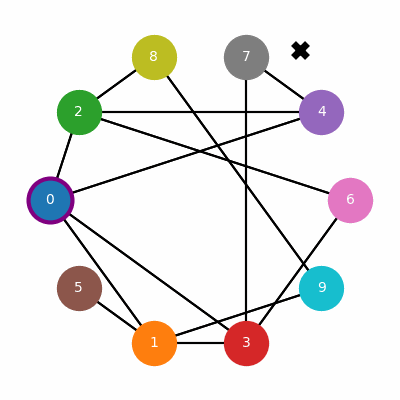

# RAG and tatters
Threadbare implementation of a RAG toolkit:
- document chunking
  - fixed length
  - Recursive Character Split (RCS)
  - document specific splitting
  - semantic splitting
- document retrieval (exhaustive search for a one-liner "vector database")
- Approximate Nearest Neighbor (ANN) with Navigable Small World (NSW) for K-Nearest Neighbor (KNN).

## Building NSW

## KNN

